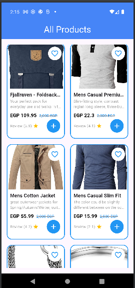

# ProductsTaskApp

This is a Flutter application that displays a list of products fetched from the Fake Store API.

## Features

- Displays a list of products in a grid layout.
- Fetches product data from [Fake Store API](https://fakestoreapi.com/products).
- Shows loading indicators and error messages.

## Screenshots

